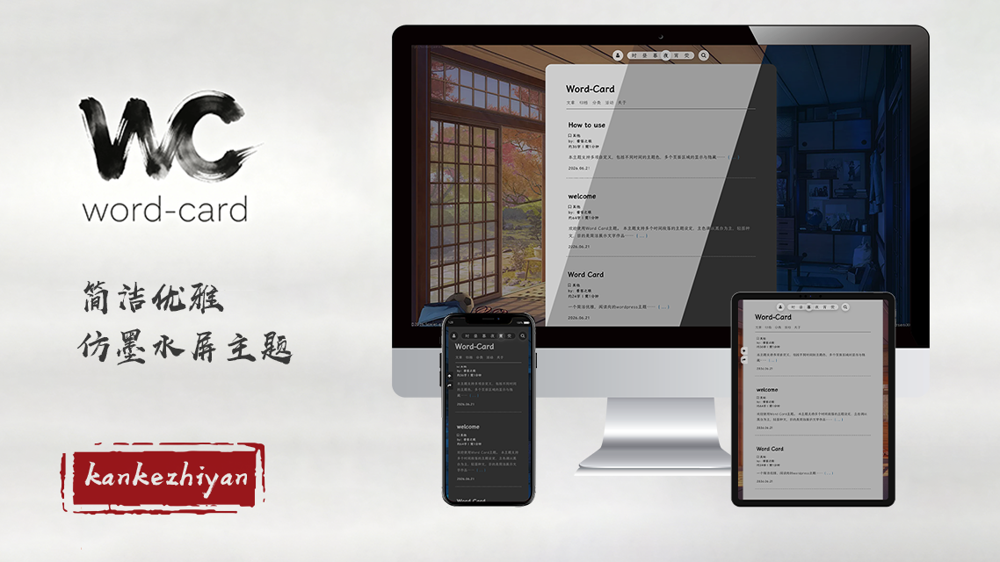

    
  
  # Word Card

 Word Card - 简洁、优雅、文字阅读向的WordPress主题

 [Hexo 版 :](github.com/kankezhiyan/hexo-theme-word-card)
  
  
  
  
  
  
  
  
  

# 关于

感谢 [hexo-theme-one-paper](https://github.com/liruiying728/hexo-theme-one-paper) 对本主题的启发。

# 展示

# 状态

> + 基础功能已完备，细节修缮中
> + 丰富功能将进行大版本更新

# 特性

+ **简洁优雅** - 使用 word card 前端框架，简洁优雅，仿墨水屏
+ **多端通用** - 支持PC、平板、手机，自适应各种屏幕尺寸
+ **轻量体积** - 主题文件体积小，加载速度快
+ **定制简单** - 可自定义主题色、顶栏、Banner、各种时间模式不同背景等，提供了丰富的自定义选项
+ **时间模式** - 支持白昼、日落，晚间，夜间，微光五种时间模式，并可以根据时间自动切换或跟随系统夜间模式
+ **内容支持** - 主页、文章页、Tag主页、分类主页、作者主页、自定义页面、文章字数和预计阅读时间
+ **多用户友好** - 前端用户信息展示，可直接通过前端登录后台、发布文章
+ **其他** - SEO 友好、Banner 支持官方一言展示或自定义一言等

# 安装

1. 在 [Release](github.com/kankezhiyan/word-card-theme/releases) 下载.zip文件
2. 登录 WordPress 后台，在 WordPress 后台 "主题" 页面上传并安装
3. 选择主题，启用 Word Card 主题
4. 配置主题设置，根据需要自定义主题
5. 完成

# 兼容性

+ WordPress 7.0+
+ 浏览器：Chrome、Firefox、Safari、Edge

# 注意

Word Card 使用 [GPL V3.0](https://github.com/kankezhiyan/word-card-theme/blob/main/LICENSE) 协议开源，请遵守此协议进行二次开发等。

您**必须在页脚保留 Word Card 主题的名称及其链接**，否则请不要使用 Word Card 主题。

# TODO

+ [  ] 多语言
+ [  ] 短代码支持
+ [  ] pjax支持
+ [  ] 自定义字体支持
+ [  ] 支持图片放大预览
+ [  ] 浏览器兼容性提升